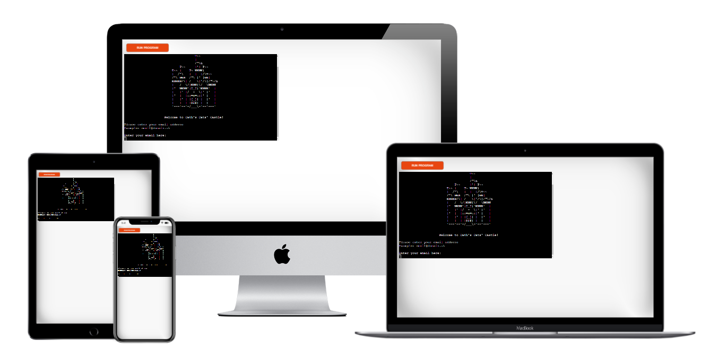
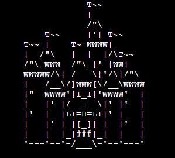
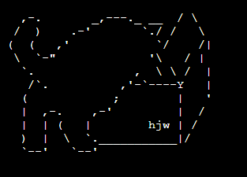
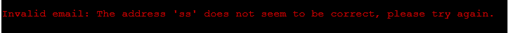
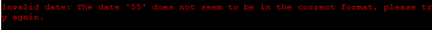
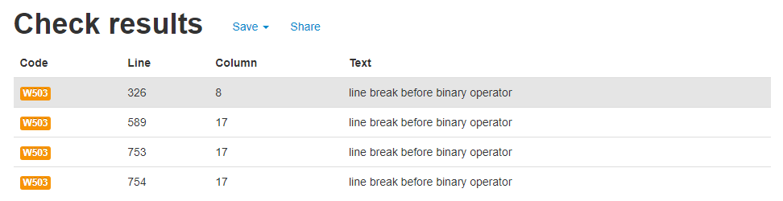

# Cath's Cats' Castle - booking
## Screenshot 

link to live page [here](https://caths-cats-castle-booking.herokuapp.com/)

## Aim of the program

The aim of the website is to allow users to book their cats' stay in the fictitious cattery callded Cath's Cats' castle. 
The project was designed for the purpose of completing Portfolio 3 Project for Diploma in Software Development (E-commerce Applications) with Code Institute

## Structure of the program

The program is a comand line program that leads the user through series of questions. 
1. Start
The user is asked for the email
2. The program checks if it is a returning customer
3. The program gives user options to choose from - different options for returning and different for a new customer
    - add - to add a new booking
    - show - to show room's availibility
    - print - to print returning user's booking
    - cancel - to cancel returning user's booking
    - change - to change returning user's booking
    - quit - to quit the program

4. When the user wants to action any of the above options he will be asked for
    - start date
    - end date
    - rooms (depending on the option)

5. Once the proces is compleated - the spreadsheet gets updated with apropriate action
    - add - adds data to spreadsheet
    - cancel - removes data from spreadsheet
    - change - adds and removes data from spreadsheet

6. After each action, the user is always given returning user options, so he could make another action

7. User can quit the program - when the question to choose the options is displayed.

## Features

1. Images - [ascii art](https://www.asciiart.eu/buildings-and-places/castles)
the image of the castle is shown when the program starts. This gives a nice introduction to the product.
the image of a cat climbing into a box is shown when the program ends. This gives a memorable goodbye to a user.

2. [Colorama](https://pypi.org/project/colorama/)
added feature to allow different colors of fonts to display in the terminal. The aim of this feature is to help the user understand what the program is doing or what is expected of the user. Since comand line interface is not user friendly, the user is not used to read various lines to understand that there was error returned. Once the error message is in red it stands out amongs other lines and allow user to action on it. 

While the program is saving things in the spreadsheet it can take a while. The blue lines of code informing the user that the program is saving data help the user to understand that the program is still working, it hasn't broken, it is just taking the time to save data.
- the ValidationErrors are displaid in red
- the positive validation messages are displayed in green
- the information about saving data in spreadsheet are displayed blue

3. Validation
Various validation on user input allows the user to run the program without errors. The aim of validation is to capture varius incorrect entries by the user and give feedback to the user. This way the user can give correct input and the program will give the user result. This also prevents program from crushing. Example of error validation message can be found below:

4. Terminal of 80 characters wide and 24 rows high

## Styling

Styling in the terminal is very limited. The interaction with the user is by Validation errors or messages informing that input has passed validation.
To make the terminal messages more intuitive colorama colors were introduced. The error messages are in red and positive validation messages are in green. Also some images was added as welcome and goodbye screen.

If user wishes to see their booking, it is displayed one line under another so it is clear to see the pairs key - value (date - booking)

## Bugs
1. Issue with accessing data needed to update both worksheets.

    Each set of data: dates, email, room number were local variables in the new booking function. Managed to pass various variables to the functions so each value is read correctly.

2. Issue with Rooms Worksheet

    Recording new booking - new booking was not apearing in the apropriate column for the room. Found that data is saved under identical column number as it is saved in clients worksheet. Found function that was refering to clients worksheet and replaced it with variable worksheet. Worksheet wariable had the appropriate worksheet passed to it when the function was called and the correct column in the rooms worksheet was updated.

3. Issue with lenght of the line:

    - the errors were raised in the lines where the if statement was very long. followed advice from [stack overflow](https://stackoverflow.com/questions/5253348/very-long-if-statement-in-python)

    - the error with very long regex - Initialy I was reluctant to touch it due to complexity of the code and worry that I would break it. My mentor Felipe Sousa has suggested solution on [stack overflow](https://stackoverflow.com/questions/8006551/how-to-split-long-regular-expression-rules-to-multiple-lines-in-python/8006576#8006576) which didn't seem to work fully. I implemented some kind of different solution that didn't break the regex. 

4. Bug caused by is_empty_cell function.

    The function was supposed to test if the cell is empty, I tried to use it both for validation of new booking as well as cancellation of the existing booking. There logic was incorrect and I created the seperate function to is_full_cell - to test if all cells are full. 

5. Bug in deleting the booking from the spreadsheet. 

    - the user inputs the dates for cancelation. The dates are validated for format
    - next the program checks what was the room name on the first date within cancelation period in the clients spreadsheet
    - the program deletes the booking from the rooms spreadsheet on the basis of what room was within the first day of booking
    - the assumption is that the client will book a longer period of time in the same room, he will not change rooms
    - I tried to capture the room name from the clients spreadsheet, which introduced a new bug, which I have not been managed to fix,
    - I reversed to the version of the function that assumes that the room that is being cancelled is the same for the whole cancelation period
    solution: ask the user to input the room which he wants to cancel. Validation needs to match dates and the room.
    return an error if any of the cells are empty within given dates in column room or in column email

6. Double booking

    Program only checks if the room is available on those dates, it can over ride the entries of old booking under the client's email and add an new booking in a different room. The client would end up having 2 rooms booked in the same time, but only the most recent room would display under his name.

7. Double emails

    Program was allowing to add a new email to spreadsheet if the user used lower case or upper case differently to previous entry. Fixed error by returning the email string as all lowercase.

8. Errors inputed by image of the castle

    the gitpod displays various errors, not accepting the characters that are used in the castle image. I need to leave those as they are as it would ruin the image if I delete or edit those characters

9. Error in room number

    When user was putting the letters instead of a number, the validation error was not displaying a correct message. The message was "invalid literal for int() with base 10". This would not help user to estimate what he has done wrong. 

    I added another validation - regex to validate input if it is numbers or other symbors. I also moved int() function to the elif statement so the input is changed to integer only after it passes validation that it is actualy the number. The regex I found on [stack overflow](https://stackoverflow.com/questions/50177113/regex-for-only-numbers-in-string) accepts digits and space - which gives the user a little more flexibility if accidental white space is input. 

10. Program crushing when attempting to print dates, when booking was none

    It seems that when cell vaue was empty, the python was returning None, not an empty strig. Python was returning error that it can only concate strings, not none.
    I have added if statement to check if value is an empty string or if value is none so it converts the val to string "None" This way I could concate string and print the data for the user in the form that I have designed.

11. Gspread error - Exceeded read requests per minute per user.

    During intense testing I have received the error that I have exceeded the Read requests per minute per user. This seem to be limitation of the use of free and simple data base like this. The error message can be found [here](assets/images/error-gspread.png).

12. User can't cancell the booking

    One of the testers (something@aol.com) reported that they can see their booking displayed by their program (booking Glasgow  10-20 October 2021), but the program doesn't allow them to cancell this booking. 

    When checking the spreadsheet I realised that this booking was saved in clients_worksheet, but not in rooms_worksheet. Further investigation revealed that the tester had API error during booking of this room. This interupted the process of saving. 

13. Confusing message about date in the past

    Tester pointed out that the program shows error - Date in the past for today date. This is due Python converting user input from string to Python date time object, which makes it Today midnight, while python today object takes the time from now. This means that user inputing today's date is considered by python as being in the past.

    I have reworded the error message so it explains that booking is available from tomorrow onwards.  

## Remaining Bugs

From the above mentioned list the bugs that were remaining

8. issue with errors raised by image of the castle - I left it untouched as editing it might destroy the image

11. Gspread error - Exceeded read requests per minute per user.

    Gspread seems to be very simple database and sufficient for a small project (or a small hotel). For any robust and reliable website, different type of database should be used. 

12. User can't cancel the booking
    The data base was designed as two worksheets and if anything breaks in between them than bookig is not valid. Unfortunately it is too late to change the database completly but it is another weeknes of the chosen type of database.
  
## Validation

1. Email validation
    - used regex to validate if the user's input resambles a standard email
    - program converts the email to small leters and save it in this format in the spreadsheet to prevent double entries in different formats

2. Date validation
    - used regex to validate the date format
    - checking if the input date is not in the past

3. Period of booking validation
    program checks if the booking is not 
    - shorter than 7 days
    - longer than 30 days
    - end date was input before start date
4. Room number validation
    - validates if user input is a digit or digit and a white space
    - validates if the number is between 1 - 9

8. User options validation
    - empty input returns value error
    - random letters return error
    - random words return error
    - validation looks for keywords to be present

## Deployment

The site was deployed to Heroku. Please follow the below steps.

### Deployment steps

1. add list of requirements by writing in the terminal "pip3 freeze > requirements.txt"
2. Add six and colorama==0.4.4 as they didn't seem to add automaticaly
2. Git add and git commit the changes made
3. Log into [Heroku](https://dashboard.heroku.com/apps) or create new account and log in

4. top right hand corner click "New" and choose option Create new app, if you are new user, the "Create new app" button will apear in the middle of the screen
5. Write app name - it has to be unique, it cannot be the same as this app
6. Choose Region - I am in Europe
7. Click "Create App"

The page of your project opens.
8. Choose "settings" from the menu on the top of the page
9. Go to section "Config Vars" and click button "Reveal Config Vars"

10. Go to git pod and copy the content of "creds.json" file
11. In the field for "KEY" enter "CREDS" - all capital letters
12. Paste content of "creds.json" and paste to field "VALUE" Click button "Add"
13. Add another key "PORT" and value "8000"

14. Go to section "Build packs" and click "Add build pack"
    - in this new window - click Python and "Save changes"
    - click "Add build pack" again
    - in this new window - click Node.js and "Save changes"
    - take care to have those apps in this order: Python first, Node.js second, drag and drop if needed

15. Next go to "Deploy" in menu bar on the top 
16. Go to section "deployment method", choose "github"
17. New section will apear "Connect to github" - Search for repository to connect to
18. type the name of your repository and click "search"
19. once heroku finds your repository - click "connect"

20. Scroll down to section "Automatic Deploys"
21. click "Enable automatic deploys" or choose "Deploy branch" and manualy deploy
22. Click "Deploy branch"

Once the program runs:
you should see the message "the app was sussesfuly deployed"
23. Click button "View"

### Forking the GitHub repository
By forking out of this repository you will be able to view and edit the code without affecting the oryginal repository. 

1. Locate the github repository. Link can be found [here](https://github.com/JoGorska/hotel-booking).
2. Click the button in top right hand corner "Fork"
3. This will take you to your own repository to a fork that is called the same as oryginal branch. 

### Making a local clone

1. Locate the github repository. Link can be found [here](https://github.com/JoGorska/hotel-booking).
2. Next to green Gitpod button you will see a button "code" with arrow pointing down
3. You are given option to open with github desktop or download zip
4. You can also copy https full link, go to git bash and write git clone and paste the full link

## Further developement the website

1. Change database

    The system of saving data that I have introduced inputs new column each time a new user is registered. This makes the spreadsheet really big.
    I have prepared the spreadsheet to accomodate booking untill 26/05/2024. Any further booking would requre manualy extending the spreadsheet to add more rows and more dates. 
    Each booking should be registered as a new row with email, date, room as the columns and have unique refference number. This way user could easily reffer to this particular booking, cancel it or change it.

    Gspread has also strong limitations on number of API requests. It was not good for the testing of the app. I can also see the problems if the hotel was introducing any last minute deals - the database would get blocked with too many clients trying to book at the same time.

2. Connect to the live page of the hotel

    Live page cor Cath's cats Castle can be found [here](https://jogorska.github.io/Luxury_cat_hotel/index.html).

    The comandline interface is not user friendly. User needs to be able to see the rooms, while he makes a choise. 

    Also booking a cat into a cattery requires the cat owner to put a lot of data of the cat, so appropriate care can be put in place. Inputing data on a comandline interface can be difficult. It is so much better to use HTML form with drop downs and radio buttons plus validation suggesting the correct format before form is subbmited. 

## User stories

### First time visitor

- I want be able to add a booking
- I want to be able to check if the room is available for me to book
- Once I added my booking I want to be able to change it or cancell.
- I want to be able to print my booking.
- I want to be able to quit the program and not continue with the booking.

### The goals were accomplished in the following ways

- First time visitor is given option to add booking.
- First time visitor can use option to show room's availiblity. User can choose dates and room, that we wants to check. 
- Once his new booking is saved, he is given options to change it or cancell
- After the booking is completed the user can print his own booking to the terminal
- User can quit the program as soon as the options are shown. This can be after he has input his email or after completed booking

### Returning visitor

- I would like the program to recognize my email as a returning customer.
- I want to be able to add a new booking.
- I want to be able to change my booking.
- I want to be able to cancel my booking.
- I would like to be able to check if the room is available in my choosen dates
- I would like to check my own booking.

### The goals were accomplished in the following ways

- Program check user's email and displays welcome message when email is found in the database.
- The option to show room's availiblity is enabled for returning customer as well. User can choose dates and room, that we wants to check. 
- Once his new booking is saved, he is given options to change it or cancell
- After the booking is completed the user can print his own booking to the terminal
- User can quit the program as soon as the options are shown. This can be after he has input his email or after completed booking

## Technologies used
- Code Institute template with HTML and CSS
- Python
- google sheets
- Libraries:
    * gsptread
    * re
    * colorama
    * google.oauth2.service_account
    * datetime

## Testing

1. [Pep8online](http://pep8online.com/)

The code has been put through validation Pep8online. I have checked the errors displayed initialy. The error reports can be found here: [first report](assets/images/pep8-errors.png), [second report](assets/images/pep8-final.png). Final version of the report can be found below:

Line 326, 589. 753, 754 - if statement is very long in those lines and had to be split into two lines. Pip8 returns it as an errror, alternative would be to have whole if statement in one line - than pip8 would return error - line too long. 

2. Different operating system
    * Windows computer: all working correctly
    * Linux computer: all working correctly
    * Samsung galaxy note 8: all working correctly
    * Samsung galaxy A40: instead of the input that user is trying to type it inputs random letters or numbers. Schreenshot option is blocked on this phone (work phone) The photo of the screen can be seen [here](assets/images/samsunga40.png). It seems like it is an issue of the phone, rather than an app. It might be something to do with autofill.

3. Testing validation
    * email
        - submiting empty input returns error
        - missing "@" - returns error
        - fullstop "." in wrong place - returns error
        - putting letters only returns error
        - putting numbers only returns error

    * dates
        - submiting empty field returns error
        - putting all numbers returns error
        - putting all letters returns error
        - putting date with "." instead of "/" returns error
        - putting month one digit only returns error
        - putting year as two digit only returns error
        - putting date in the past returns error
        - putting end date earlier than starts date returns error after the period of booking is validated
    * room
        - putting letters instead of number returns validation error that you have entered other characters than a number
        - putting other characters - not numbers returns the same validation error
        - program returns validation error when two digit number is entered instead of one digit
        - empty input gives error that you have entered other characters than a number.

    * returning user options
        - putting empty value returns validation error
        - putting numbers, random letters or sighns returns a validation error

## Thanks to
- [Code Institute Template](https://github.com/Code-Institute-Org/python-essentials-template)
- [Asciiart](https://www.asciiart.eu/buildings-and-places/castles)
- Fernanda Brito - for help with Readme 
- Richard Eldridge - for extensive testing
- Felipe Sousa Alarcon - for mentoring 

